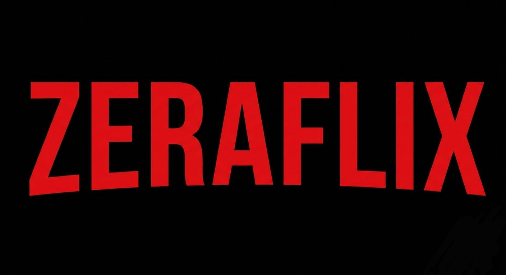

# ZERAFLIX

---

## Proje Hakkında

**Proje Tanımı:** Zeraflix, kullanıcıların çeşitli kategorilerde film ve dizi içeriklerini keşfedebileceği, kendi izleme listelerini oluşturabileceği ve içerikleri izleyebileceği kullanıcı dostu bir Netflix klonu projesidir. Modern web ve mobil teknolojileri kullanılarak geliştirilmektedir.

**Proje Kategorisi:** Video Akış Platformu (Streaming) / Eğlence

**Referans Uygulama:** [Netflix](https://www.netflix.com)

---

## Proje Linkleri

- **REST API Adresi:** *(Proje ilerledikçe eklenecek)*
- **Web Frontend Adresi:** *(Proje ilerledikçe eklenecek)*

---

## Proje Ekibi

**Grup Adı:** Polaris

**Ekip Üyeleri:** - Zehra *(Not: Proje tek kişi tarafından yürütülmektedir)*

---

## Gereksinim Analizi
*(Not: Polaris takımı tek kişiden oluştuğu için tüm gereksinimlerin geliştirme sorumluluğu Zehra'ya aittir.)*

**Temel Gereksinimler:**
1. **Kullanıcı Kaydı Olma (POST):** Yeni kullanıcıların e-posta ve şifre bilgilerini girerek sisteme üye olmasını sağlar.
2. **Giriş Yapma (POST):** Mevcut kullanıcıların kayıtlı bilgileri ile sisteme erişim sağlamasına olanak tanır.
3. **Profil Bilgilerini Güncelleme (PUT):** Kullanıcının profil adını, dil tercihini veya profil fotoğrafını değiştirmesine olanak tanır.
4. **Profil Silme (DELETE):** Kullanıcının artık kullanmak istemediği profilleri sistemden kaldırmasını sağlar.
5. **Film ve Dizi Listeleme (GET):** Ana sayfada kategorilere ayrılmış film veya dizi içeriklerinin kullanıcıya gösterilmesi.
6. **İçerik Arama (GET):** Kullanıcının arama çubuğuna yazdığı kelimeye uygun film veya dizileri bulup listeler.
7. **Listeme Ekleme (POST):** Kullanıcının daha sonra izlemek istediği bir içeriği "Listem" bölümüne kaydetmesini sağlar.
8. **Listeden Çıkarma (DELETE):** "Listem" bölümündeki bir içeriği listeden temizlemesini sağlar.
9. **İçeriğe Puan Verme (PUT):** Kullanıcının izlediği bir içeriği beğenip beğenmediğini güncellemesini sağlar.
10. **İzleme Geçmişi Görüntüleme (GET):** Kullanıcının daha önce izlemeye başladığı veya bitirdiği içerikleri listeler.

**Ekstra Özellik (Bonus):**
11. **Kişiselleştirilmiş Öneri Sunma (GET):** Kullanıcının izleme geçmişine dayalı olarak, yapay zeka destekli algoritmalarla kişiye özel içerik önerileri sunulması.

---

## Dokümantasyon

Proje tek kişi tarafından yürütüldüğü için geliştirme dokümanları aşağıdaki dosyalarda takip edilecektir:

1. [Gereksinim Analizi Detayları](Gereksinim-Analizi.md)
2. [REST API Tasarımı](API-Tasarimi.md)
3. [REST API Görevleri](Rest-API.md)
4. [Web Front-End Görevleri](WebFrontEnd.md)
5. [Mobil Front-End Görevleri](MobilFrontEnd.md)
6. [Mobil Backend Görevleri](MobilBackEnd.md)

---
